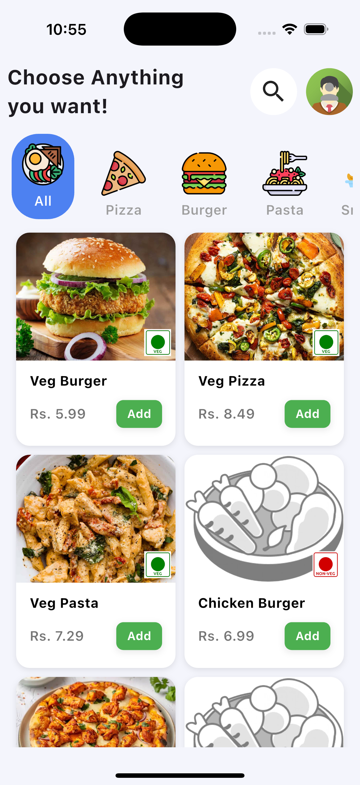
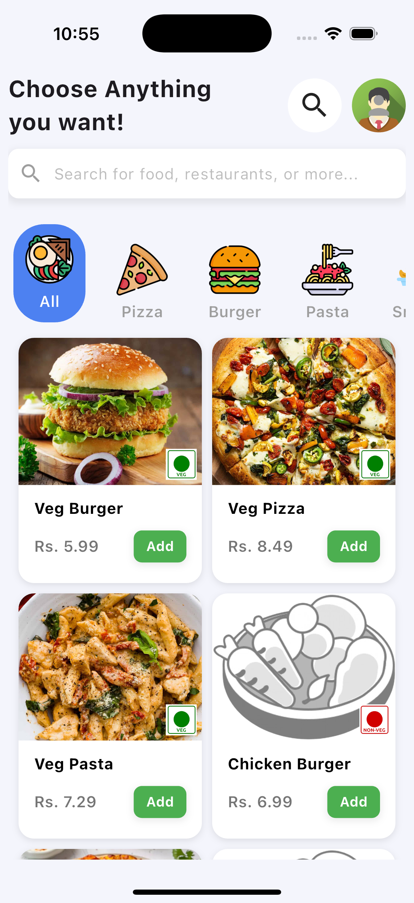
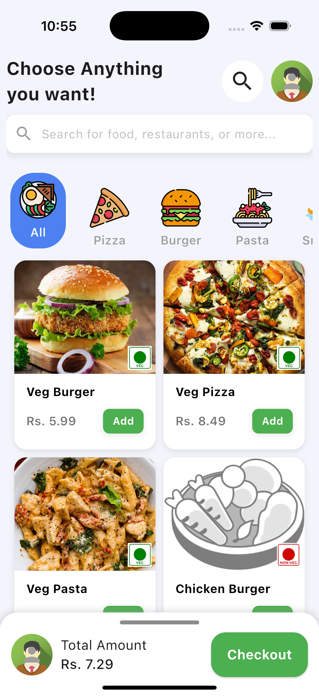
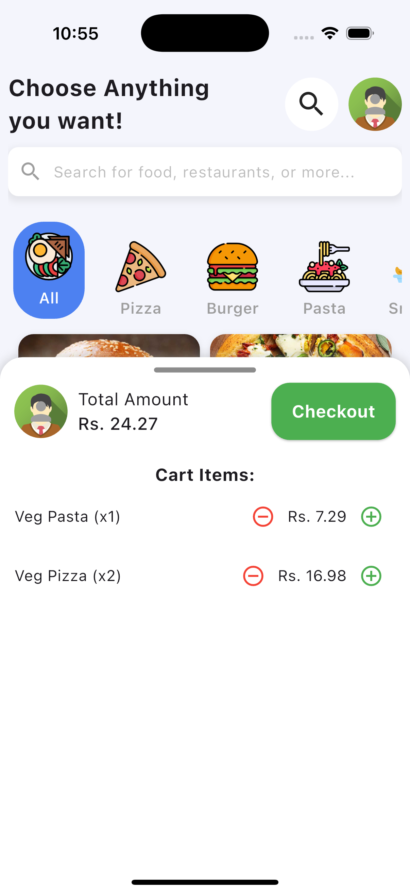

# 🍔 Food Ordering App

A modern and user-friendly **food ordering app** that allows users to browse menus, place orders, and track deliveries in real time. Built using **Flutter, Firebase, and BLoC** for smooth performance and scalability.

---

## 🚀 Features

✅ **User Authentication** – Sign up, login, and manage profiles  
✅ **Browse Restaurants & Menus** – Discover a variety of food options  
✅ **Add to Cart & Checkout** – Seamless order placement  
✅ **Real-time Order Tracking** – Track food delivery status  
✅ **Secure Payments** – Integrated payment gateway  
✅ **Push Notifications** – Get updates on order status

---

## 🖼️ App Screenshots

### Home Screen




### Checkout



---

## ⚙️ Tech Stack

- **Frontend**: Flutter (Dart)
- **Backend**: Spring-Boot
- **State Management**: BLoC
- **Push Notifications**: Firebase Cloud Messaging (FCM)
- **Payment Integration**: Stripe/Razorpay

---

## 🛋️ Installation

1. Clone the repository
   ```sh
   git clone https://github.com/yourusername/food-ordering-app.git
   ```
2. Navigate to the project folder
   ```sh
   cd food-ordering-app
   ```
3. Install dependencies
   ```sh
   flutter pub get
   ```
4. Run the app
   ```sh
   flutter run
   ```

---

## 📸 How to Attach Images in README

To display images in your `README.md`:
1. Place your **app screenshots** inside a `screenshots/` folder in your project.
2. Use this Markdown syntax to add images:
   ```markdown
   
   ```
3. If hosting externally (e.g., on **GitHub**), use:
   ```markdown
   
   ```

---

## 🎉 Contributing

Want to contribute? Feel free to **fork the repo** and submit pull requests!

📩 For any queries, contact **daipayanneogi@gmail.com**  

